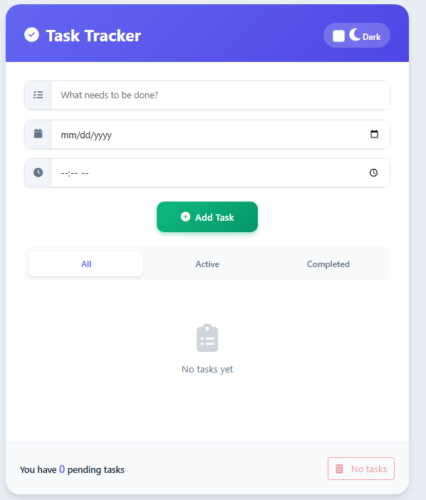
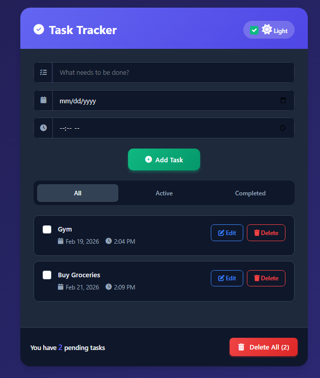

# Task Tracker

A clean, modern Todo web application built with HTML, CSS, Bootstrap 5, and vanilla JavaScript.

## Features

- Add tasks with title, due date, and time
- Edit and delete tasks using modals
- Mark tasks as completed with checkbox + strike-through style
- Filter tasks: All / Active / Completed
- Filter-aware "Delete All" button (deletes only visible tasks in current filter)
- Automatic pending task counter
- Dark mode toggle
- LocalStorage persistence (tasks saved after refresh)
- Responsive design (works great on mobile and desktop)

## Live Demo

https://saturn217.github.io/Task-Tracker-webApp/

## Screenshots

| Empty State                  | With Tasks & Dark Mode       |
|------------------------------|------------------------------|
|  |  |

(Add more screenshots if you have them)

## Technologies

- HTML5
- CSS3
- Bootstrap 5
- Vanilla JavaScript
- LocalStorage
- Font Awesome icons

## How to Run

1. Clone the repository:
   ```bash
   git clone https://github.com/Saturn217/Task-Tracker-webApp.git
